# W2D (Whatsapp to Discord)


Use Whatsapp through Discord

[FEATURES](#features)

This project is built on top of @open-wa/wa-automate and discord.js.<br>
https://www.npmjs.com/package/@open-wa/wa-automate<br>
https://www.npmjs.com/package/discord.js<br>

## Before Usage

- Create an application and a bot on discord developer website.
- Create an server for you (and **ONLY YOU!!!**).
- Add the bot to the server with scopes `bot` and `applications.commands` and with bot permissions `Administrator`.
- Get the discord bot token and client id.

---

## Usage (docker)

- Firstly, do the the things of `Before Usage` section.
- Install docker if you havent.
- Run the following command to start the bot:

Replace `YOUR_BOT_TOKEN` and `YOUR_BOT_CLIENT_ID` with your bot token/client id.<br>
Replace `PATH_TO_SAVE_STATE` with a path to the state directory, I recommend to put the absolute path of project root + "/state" (eg.: Project path: "/usr/w2d", State: "/usr/w2d/state")<br>
Replace `TIMEZONE` by your own timezone, [here you can find the available values for](https://gist.github.com/diogocapela/12c6617fc87607d11fd62d2a4f42b02a).<br>
Optionally customize the birthday check interval(in milliseconds) using the environment variable `BIRTHDAY_CHECK_INTERVAL`.

```
docker run --rm -it -e DISCORD_BOT_TOKEN={YOUR_BOT_TOKEN} -e DISCORD_BOT_CLIENT_ID={YOUR_BOT_CLIENT_ID} -e WA_EXECUTABLE_PATH="/usr/bin/chromium-browser" -e WA_HEADLESS=true -e TZ={TIMEZONE} -v {PATH_TO_SAVE_STATE}:/app/state vanflux/w2d
```

- Now, go to the discord server and scan the qrcode.

Every time you run the command you will need to scan the code again because of an integrity check fail problem.

---

## Usage (development)

- Firstly, do the the things of `Before Usage` section.
- Ensure that your node version is **16.6.0** or newer 
- Install image magick and(for windows users) add to the environment path vars.
- Install ffmpeg and(for windows users) add to the environment path vars.
- Create a `.env` file on the project root and write the following:
```
DISCORD_BOT_TOKEN={YOUR_BOT_TOKEN}
DISCORD_BOT_CLIENT_ID={YOUR_BOT_CLIENT_ID}
```
- Run `npm i` to install dependencies.
- Run the bot with `npm start`, scan the qr code and enjoy.

---

## Building docker image from source

- Clone this project.
- Run `docker build -t w2d --network host .`

---


## Features

### **Channels**

- Qrcode receiving
- Audio Editing (add zap.mp3 sound at the end of the audio)
- Record audios

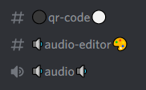

- Chats

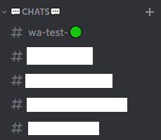


### **Receiving / Sending**

You can receive more things than you can send at the moment.
You only can send texts, images and audios.

- Receive Text

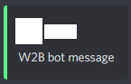

- Receive replies

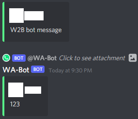

- Receive Image

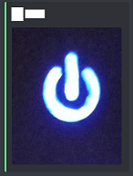

- Receive Audio

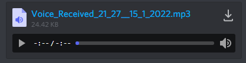

- Receive Video

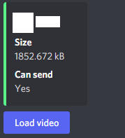

- Receive Document

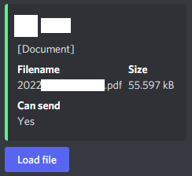

- Receive Location

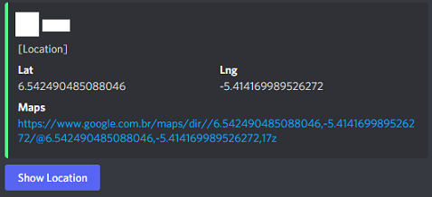

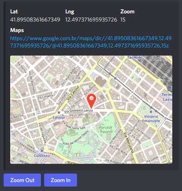

- Receive Sticker

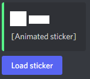

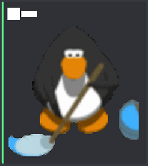

- Receive Gif

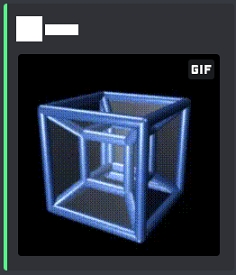

---

## Problems

- For some reasong when I enable the headless mode sometimes the integrity check doesnt work. Then, by default, its disabled, if you want to enable go to `whatsapp.ts` file on `src/bots` dir and change what you want. I think it is happening because multi device support is very recent.

---

## Contributing

- Fork it, do what you want and request the merge.

---

## I'm responsible for any damage?

**NO**, use at **your** risk!
